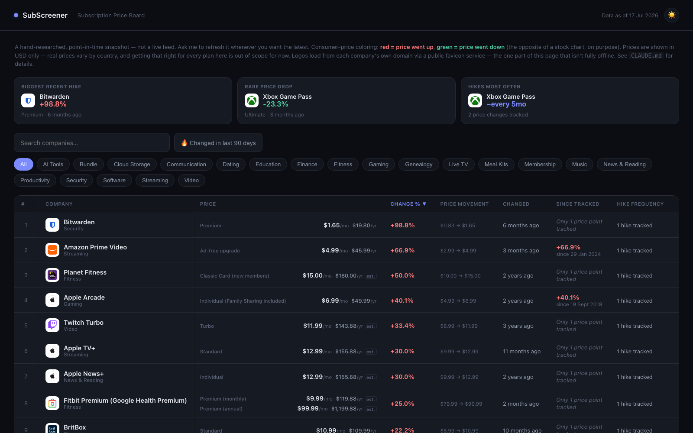

# SubScreener

A stock-screener-style price board for subscription services — because prices only ever seem to go one direction, and nobody tells you until the charge hits.

**[Live demo →](https://jozsuaheng.github.io/Subscription-screener/)**

## What it does

SubScreener tracks 100 well-known subscription companies (streaming, music, software, AI tools, gaming, fitness, dating, and more) in one sortable, filterable table:

- **Per-tier pricing** — every plan a company offers (ad-supported, ad-free, family, etc.), monthly and annual, side by side
- **Real price-change history** — every hike is sourced with a link to where it was reported, never guessed
- **Hike frequency & forecasts** — how often a company tends to raise prices, plus any officially-announced future changes, always kept visually distinct from pattern-based estimates
- **Category comparisons** — how a company's price stacks up against others in its category
- A **"biggest movers" highlights strip**, a "changed in the last 90 days" quick filter, hover tooltips on the trend charts, and a mobile-friendly card layout below ~1000px

Click any row to expand its full sourced price-change history.

## How it's built

Plain HTML, CSS, and vanilla JavaScript — no build step, no framework, no backend. Clone it and open `index.html`; that's the whole setup.

The dataset is hand-researched, not scraped — see [`CLAUDE.md`](./CLAUDE.md) for the full house rules (never invent a number, every price needs a real source). It's refreshed on request, plus a scheduled monthly check that proposes any genuine price changes it finds on a review branch — nothing goes live without a human checking the sources first.

## Why

Because "wait, when did this get more expensive?" is a universal feeling, and there wasn't a good single place to just... look.
